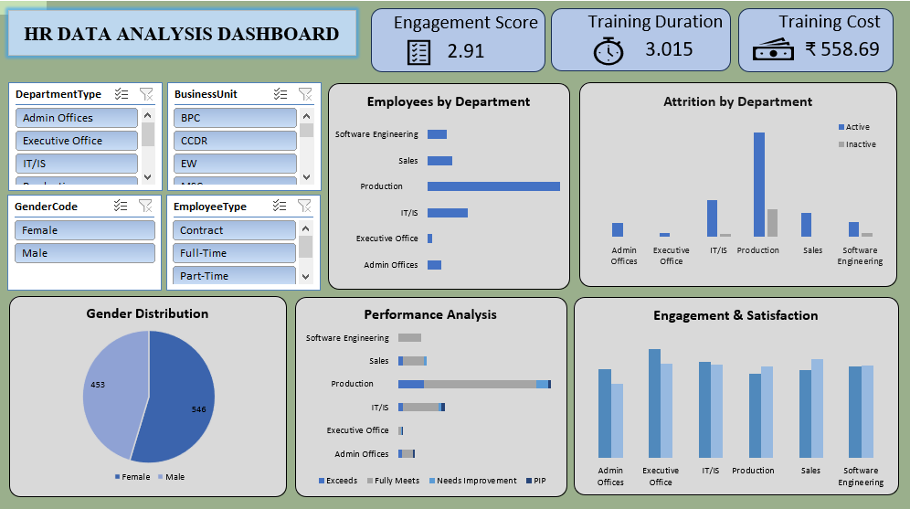

## HR Data Analysis | Excel

## Project Objective:
The primary goal of this project is to analyze HR data to understand employee distribution, performance metrics, and training efficiency. This analysis helps HR managers identify areas for improvement in employee engagement and retention.

## Data Tools & Techniques:
--Tool: Microsoft Excel
--Data Cleaning: Removed duplicates and handled missing values in the HR dataset.
--Pivot Tables: Summarized data of over 999 employees to find meaningful trends.
--Dashboarding: Created an interactive visual report using Charts and Slicers.

## Key Steps & Analysis:
1.Workforce Diversity: Analyzed the gender ratio (55% Female, 45% Male) to ensure workplace inclusivity.
2.Performance Review: Categorized employees based on performance scores (Exceeds, Fully Meets, PIP) to help management identify top talent.
3.Training Cost Analysis: Calculated the average training cost per employee, which is ₹46,650, with an average duration of 3 days.
4.Departmental Headcount: Production and IT/IS were identified as the departments with the highest number of employees.

## Dashboard Preview:

## Business Insights:
--Active vs Inactive: Identified the turnover rate by analyzing the status of employees (Active/Inactive) across departments.
--Cost Management: The training cost analysis in Indian Rupees (INR) provides a clear picture of the investment made in employee skill development.
